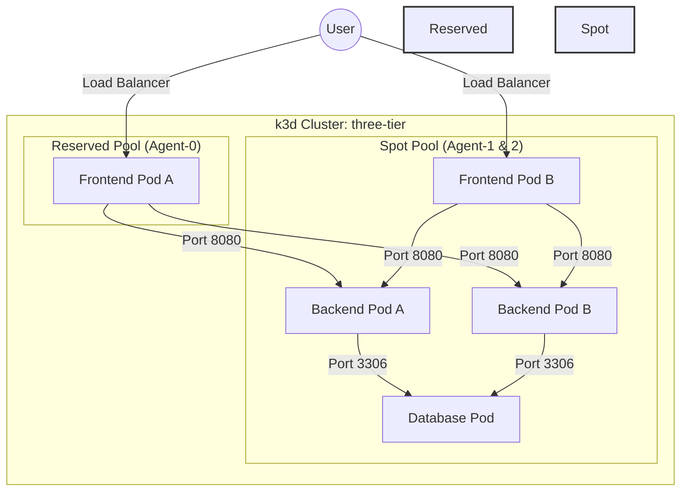

# 🚀 Secure 3-Tier Kubernetes Topology

A production-grade, local Kubernetes environment built with **k3d**, demonstrating advanced scheduling, zero-trust networking, and automated security enforcement.

---

## 🏗️ Architecture Overview

The system implements a classic 3-tier architecture (Frontend, Backend, Database) distributed across a heterogeneous node-pool topology.



---

## 🌟 Key Features

### 1. Workload Isolation & Scheduling
- **Node Affinity:** Pods are intelligently scheduled onto specific "Pools" (Reserved vs. Spot).
- **Topology Spread:** Ensures replicas don't clump together, maximizing availability even if a node fails.
- **Descheduler:** Automatically rebalances the cluster if pods are running on suboptimal nodes after a "Spot" recovery.

### 2. Zero-Trust Security
- **Network Policies:** Strict "deny-all" default. Only explicit paths (Frontend → Backend and Backend → DB) are whitelisted.
- **Kyverno Enforcement:** A Kubernetes-native policy engine that blocks insecure practices (privileged containers, `:latest` tags) before they ever reach the cluster.

### 3. Resilience & Self-Healing
- **PodDisruptionBudgets (PDB):** Guarantees minimum availability during voluntary disruptions (like node maintenance or spot termination).
- **Automated Health Probes:** Liveness and Readiness probes ensure traffic only hits healthy pods.

---

## 🚦 Getting Started (The "How-To")

### 1. Enter the Project
```bash
cd <project-folder>
```

### 2. Launch the Environment
Everything is automated. Just run:
```bash
./cluster-setup.sh
```
*This script will create the cluster, label nodes, deploy the 3-tier app, install security policies, and wait for everything to be Green.*

### 3. Verify the Results
Once the setup is complete, run the automated validation suite:
```bash
./tests/validate.sh
```
*This script tests every single requirement (scheduling, networking, security) and reports a PASS/FAIL.*

---

## 📖 Deep Dive & Command Reference

For a complete explanation of every command used in this project and how to perform manual demonstrations, please see the:

👉 **[OPERATIONS_GUIDE.md](file:///e:/Abluva/OPERATIONS_GUIDE.md)**

---

## 📁 Repository Structure
```text
.
├── cluster-setup.sh        # Complete environment bootstrap
├── README.md               # You are here
├── OPERATIONS_GUIDE.md     # Deep dive command explanation
├── frontend/               # Nginx Frontend manifests
├── backend/                # Python API manifests
├── db/                     # Database simulator manifests
├── policies/               # Network & Kyverno Security policies
├── pdb/                    # High Availability budgets
├── tests/                  # Automated & Manual validation
└── security/               # Trivy vulnerability scanner
```

---

## 🧹 Cleanup
To wipe the environment and free up resources:
```bash
k3d cluster delete three-tier
```
